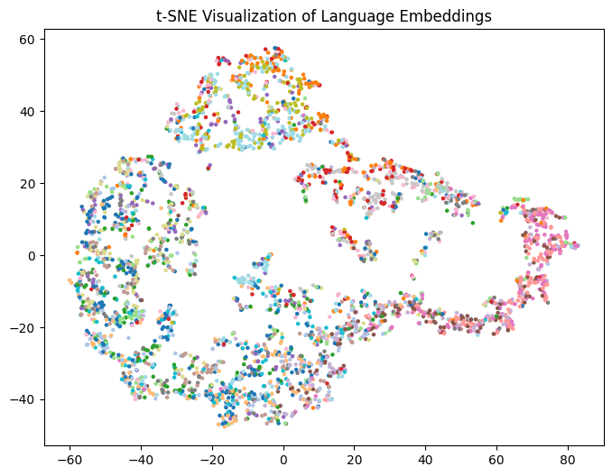

# Multilingual Spoken Language Identification

Fine-tuning multilingual speech transformers to identify **22 Indian languages** in a low-resource, speaker-biased dataset.

The project compares MMS-300M and XLS-R, studies why models learn speaker shortcuts, and evaluates targeted waveform augmentation. Selective augmentation produced the strongest experimental result: **43.4% top-1 accuracy**, compared with a **27.7% baseline-style run** and **4.54% random chance**.



## Why this project matters

The dataset is balanced across languages but contains only five speakers per language. That makes speaker identity an easy shortcut and turns ordinary language classification into a generalization problem. The work goes beyond aggregate accuracy by examining:

- per-speaker accuracy within each language;
- structured confusions among related languages;
- MMS-300M versus XLS-R fine-tuning;
- frozen and unfrozen encoder strategies;
- noise, gain, shift, replacement, addition, and selective augmentation;
- confusion matrices and t-SNE representations.

## Results

| Experiment | Accuracy | Takeaway |
| --- | ---: | --- |
| Random classifier | 4.54% | 22-way chance level |
| Baseline-style MMS run | 27.7% validation | Strong speaker and language-family confusions |
| Generic augmentation | 30.85% validation / 31.58% test | Modest improvement |
| Selective augmentation | **43.4% top-1** | Targeting confused languages worked best |

The largest errors occurred between acoustically related languages, including Hindi–Urdu, Tamil–Malayalam, Nepali–Manipuri, and Punjabi–Urdu. Assamese also showed extreme speaker-level variation, supporting the speaker-shortcut hypothesis.

## Repository layout

```text
speech_lid/       Reusable audio augmentation functions
train_model.py    Reproducible MMS-300M training pipeline
evaluate_model.py Confusion-matrix and embedding evaluation
experiments/      Baseline, augmentation, tuning, and XLS-R experiments
notebooks/        Exploratory data analysis
tests/            Lightweight deterministic unit tests
report/           Full paper, figures, and compiled PDF
docs/             Project presentation
```

## Setup

Python 3.11 is recommended. A CUDA-capable GPU is strongly recommended for training.

```bash
python -m venv .venv
source .venv/bin/activate
python -m pip install --upgrade pip
python -m pip install -r requirements.txt
```

The training pipeline downloads [`badrex/nnti-dataset-full`](https://huggingface.co/datasets/badrex/nnti-dataset-full) and [`facebook/mms-300m`](https://huggingface.co/facebook/mms-300m) from Hugging Face.

## Train and evaluate

```bash
python train_model.py
python evaluate_model.py
```

Training writes the best checkpoint to `mms-300m-nnti-final-best/`. Evaluation reads that checkpoint and writes a confusion matrix and t-SNE plot to `evaluation_final_model/`.

## Reproducibility and limitations

- The canonical training configuration uses 16 kHz audio clipped to seven seconds.
- The encoder feature extractor is frozen and the classification layers are reinitialized.
- Augmentation is probabilistic; fix Python and NumPy seeds for exact experiment replication.
- Reported metrics come from the documented coursework experiments rather than a hosted production model.
- With only five speakers per language, these results should not be interpreted as broad real-world language coverage.

For methodology, ablations, and detailed error analysis, see the [full report](report/main.pdf).

## Authors

Kashish Mendiratta and Muhammad Saqib — Saarland University, Neural Networks: Theory and Implementation, Winter 2025–26.
